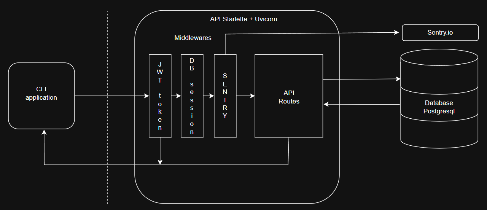

## :hash:Présentation du projet:

<hr>

## :triangular_ruler:Architecture

**1. Architecture générale**
Le projet est composé de deux applications : une API hébergée sur un serveur et une application client installée sur les postes des collaborateurs.
<br>

<br>
- L'API (backend)
:link: Accédez à la documentation Postman ici : [Lien vers la documentation](https://documenter.getpostman.com/view/38947734/2sB2cRDk3z)
L'API est développée avec les bibliothèques Starlette et Uvicorn. Elle communique avec la base de données PostgreSQL via l'ORM SQLAlchemy.
Plusieurs middlewares ont été implémentés pour :
La gestion des autorisations via des tokens JWT à chaque requête.
La création d'une session pour la base de données.
L'intégration de Sentry pour la gestion des erreurs et la surveillance.  
<br>
Les permissions et les entrées utilisateur sont vérifiées avant chaque interaction avec la base de données. Les mots de passe sont stockés de manière sécurisée grâce au hachage et au salage avec la bibliothèque argon2.
Le fichier init_db.py permet d'initialiser la base de données en créant les tables et les rôles prédéfinis. Les tests de l'API sont effectués sur une base de données distincte afin d'éviter la pollution des données de production. 
<br>
- L'application client CLI (Frontend)
L'application CLI permet aux utilisateurs d'exécuter différentes commandes avec des options et des filtres (bibliothèque Click). Les résultats des commandes sont affichés dans la console avec Rich.
Les actions et les entrées utilisateur sont également validées (permissions, format des entrées) avant l'envoi à l'API afin de réduire le nombre de requêtes et d'obtenir des réponses plus rapides en cas d'erreur.

**2. Architecture de la base de données**
Le projet utilise PostgreSQL comme base de données. Ci-dessous, le schéma des différentes tables et de leurs relations :
<br>


<hr>

## :hammer:Installation
Récupération du projet en local avec Git.
```
git clone https://github.com/PVL06/OC_P12_Epic.git
```
Si uv non installé:
- Installation d'uv:
https://github.com/astral-sh/uv
- Alternative:
Créer et activer un environnement virtuel et installer les dépendances du fichier requirements.txt.
Sous linux, ajouter la librairie getch (pip install getch).
Lancer les commandes avec "python" à la place de "uv run".

**1. Serveur (Backend):**

- Créer le fichier de configuration .env:
```
# DATABASE CONFIG
DB_USER = postgres
DB_PWD = (my password)
DB_HOST = localhost:5432

# DATABASE NAMES
DB_ROOT = postgres
DB_APP = epic
DB_TEST = epic_test

# FIRST USER, WARNING: CHANGE PASSWORD IN FIRST CONNEXION
USER_NAME = epic
USER_EMAIL = epic@epic.com
USER_PASSWORD = (first user password)

# SECRET FOR TOKEN JWT
SECRET_KEY = (my sercet key)

# SENTRY DSN
SENTRY_DSN = (my sentry dsn)
```
- Initialisation de la base de données PostgreSQL et création des tables.
```
uv run init_db.py
```
- Lancement du serveur
```
uv run server_epic.py
```

**2. Lancement de l'aide de l'application client (Voir utilisation pour les commandes et options):**

```
uv run cli_epic.py --help
```
<hr>  

## :book:CLI Utilisation

```
uv run cli_epic.py [Command] [Option] [Filter]
```
L'option --help est disponible sur chaque commande.

Commandes:  

**login**  
Se connecter avec son email et son mot de passe.
Option -e email : permet de spécifier directement l'email dans la commande (facultatif). 

**logout**
Se deconnecter


***Les commandes suivantes nécessitent une authentification avec login.***  

**password**  
Changer son mot de passe.

**collab**
Affichage des collaborateurs.
- Filtre par role:
-f [gestion, commercial, support]
- Options pour les collaborateurs ayant le role <u>gestion</u>:
-c / --create: créer d'un nouveau collaborateur.
-u / --update: mettre à jour un collaborateur.
-d / --delete: supprimer un collaborateur.

**client**
Affichage des clients.
- Filtre par client n'ayant pas de commercial assigné:
-f

- Options pour pour les collaborateur ayant le rôle <u>commercial</u>:
-c / --create: créer un nouveau client.
-u / --update: mettre à jour un client.

- Option pour pour les collaborateurs ayant le role <u>gestion</u>:
-u / --update: assigner un commercial aux clients sans commercial.

**contract**
Affichage des contrats.
- Filtres:
-f no_signed: contrats non signés
-f debtor: contrats ayant un reste à payer

- Options pour pour les collaborateurs ayant le roles <u>gestion</u>:
-c / --create: créer un nouveau contrat.
-u / --update: mettre à jour un contrat.

- Option pour pour les collaborateurs ayant le roles <u>commercial</u>:
-u / --update: mettre à jour un contrat uniquement pour leurs clients.

**event**
Affichage des événements.
- Filtre:
-f no_support: filtre les événements n'ayant pas de collaborateur support assigné
- Option pour pour les collaborateurs ayant le role <u>commercial</u>:
-c / --create: créer un nouvel événement.
- Option pour pour les collaborateurs ayant le roles <u>gestion</u>:
-u / --update: assigner un collaborateur support si manquant
- Option pour pour les collaborateurs ayant le roles <u>support</u>:
-u / --update: mettre à jour les événements qui leur sont assignés.
